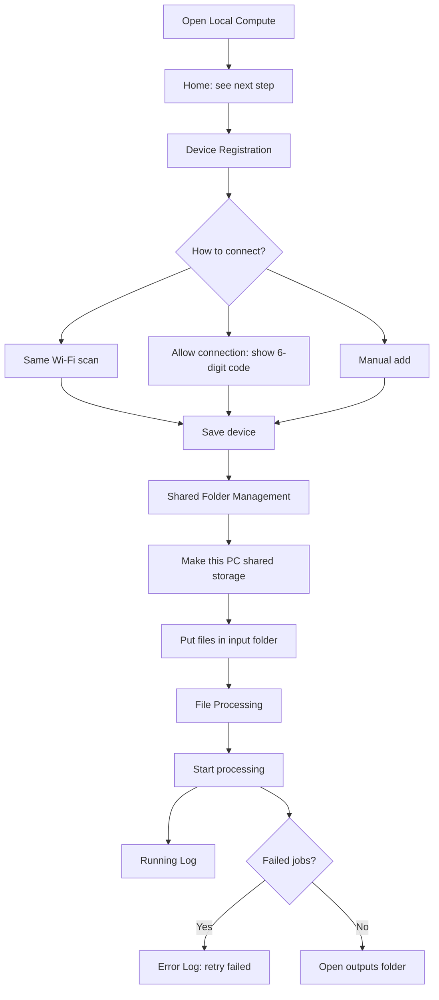
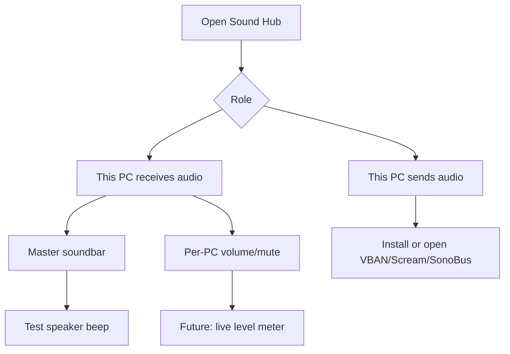

# Local Compute App UX Plan

This document is written so another AI, planner, or developer can continue the product work without reverse-engineering the code.

## Product Direction

| Principle | Decision |
|---|---|
| Target user | Non-developer, 40-60 year-old office user |
| UX style | Mobile-app-like desktop shell |
| Visual language | Large cards, clear icons, short Korean labels, one purpose per screen |
| Default path | User should not see command lines or MCP first |
| Advanced path | MCP, command templates, SSH details remain available but secondary |

## Main Navigation

| Screen | Icon | Primary Job | Main CTA |
|---|---|---|---|
| Home | Home | Show setup progress and next step | Start setup |
| Device | Link | Register/connect PCs | Allow connection / Add by number |
| Folder | Folder | Create/manage A-PC shared folder | Make this PC storage |
| Process | Lightning | Process input files | Start processing |
| Sound | Speaker | Soundbar/mixer profile | Test speaker / Check tools |
| Log | Clipboard | See running history | Refresh |
| Error | Warning | See failed jobs | Retry failed |
| MCP | Plug | AI tool connection info | Copy/use config |

## User Flow

## Sound Hub Flow

## Implementation Notes

| Concern | Current Implementation | Next Step |
|---|---|---|
| Icons | Built-in Segoe UI Emoji / symbol text | Replace with image/icon assets if packaging allows |
| Layout | Tkinter custom card shell | Can later migrate to Qt/Flet/Electron |
| Sound Hub | Mixer profile UI, tool checks | Add VBAN/Scream/SonoBus automation |
| Remote control | Documented only | Integrate RustDesk/VNC launcher rather than custom engine |
| Worker execution | SSH-based | Add agent mode for non-developer pairing |

## Copy Guidelines

| Avoid | Use Instead |
|---|---|
| input/output | 처리할 파일 / 결과 폴더 |
| command | 고급 실행 방식 |
| SSH | 기기 연결 테스트 |
| worker | 연결된 PC |
| job | 파일 처리 |
